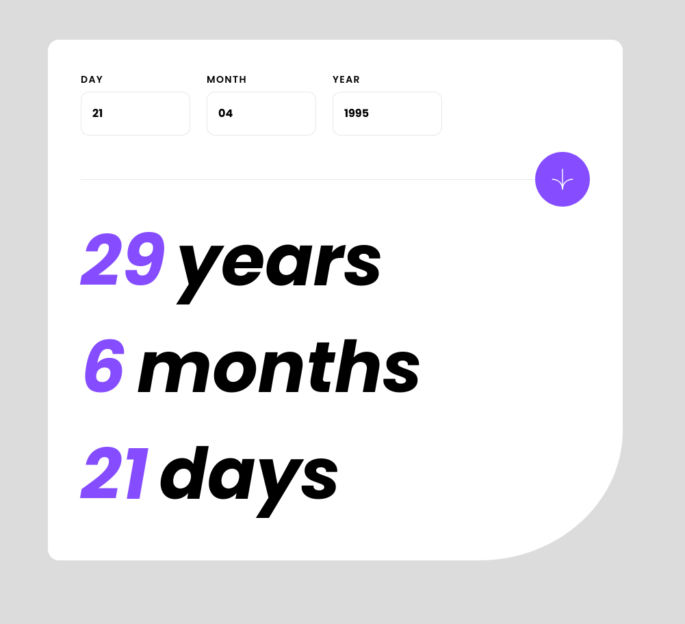

# Frontend Mentor - Age calculator app solution

This is a solution to the [Age calculator app challenge on Frontend Mentor](https://www.frontendmentor.io/challenges/age-calculator-app-dF9DFFpj-Q). Frontend Mentor challenges help you improve your coding skills by building realistic projects.

## Table of contents

- [Overview](#overview)
  - [The challenge](#the-challenge)
  - [Screenshot](#screenshot)
  - [Links](#links)
- [My process](#my-process)
  - [Built with](#built-with)
  - [What I learned](#what-i-learned)
  - [Continued development](#continued-development)
- [Author](#author)

**Note: Delete this note and update the table of contents based on what sections you keep.**

## Overview

### The challenge

Users should be able to:

- View an age in years, months, and days after submitting a valid date through the form
- Receive validation errors if:
  - Any field is empty when the form is submitted
  - The day number is not between 1-31
  - The month number is not between 1-12
  - The year is in the future
  - The date is invalid e.g. 31/04/1991 (there are 30 days in April)
- View the optimal layout for the interface depending on their device's screen size
- See hover and focus states for all interactive elements on the page
- **Bonus**: See the age numbers animate to their final number when the form is submitted

### Screenshot

### Links

- Solution URL: [Here](https://github.com/jambanix/frontendmentor_age-calculator-app)
- Live Site URL: [Here](https://jambanix.github.io/frontendmentor_age-calculator-app/)

## My process

### Built with

- [React](https://reactjs.org/) - JS library
- [TailwindCSS](https://tailwindcss.com/) - TailwindCSS
- [react-hook-form](https://react-hook-form.com/) - React Hook Form
- [moment.js](https://momentjs.com/) - Moment.JS

### What I learned

This was a good challenge for working with dates. I opted to use Moment.JS in order to save time and not reinvent the wheel. This was also the first time I created an effect where the numbers increment to their target

### Continued development

I have done a few challenges now since last doing my Udemy course, so I will take a break from the challenges for a week or 2 to concentrate on learning new concepts and deepening my understanding of React

## Author

- Frontend Mentor - [@jambanix](https://www.frontendmentor.io/profile/jambanix)
- Github - [jambanix](https://www.github.com/jambanix)
